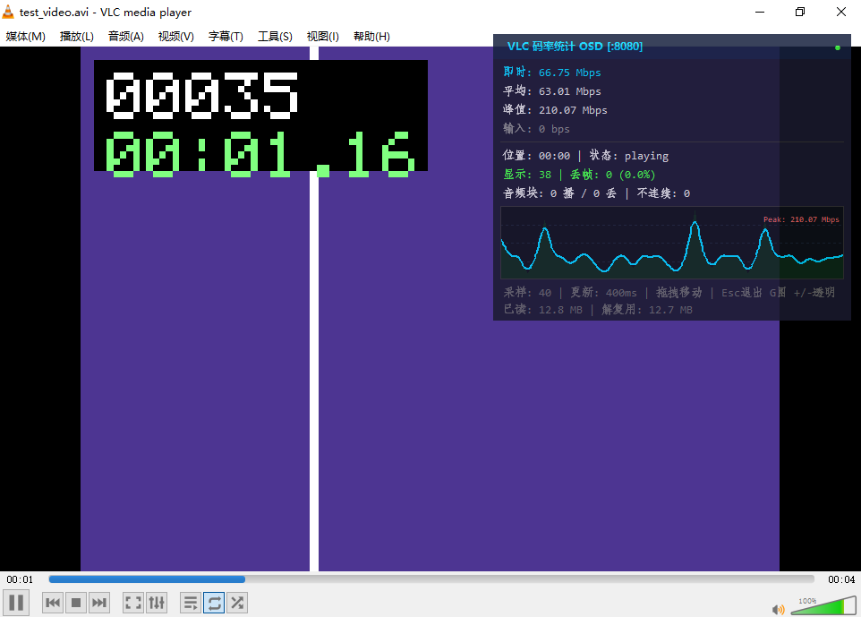
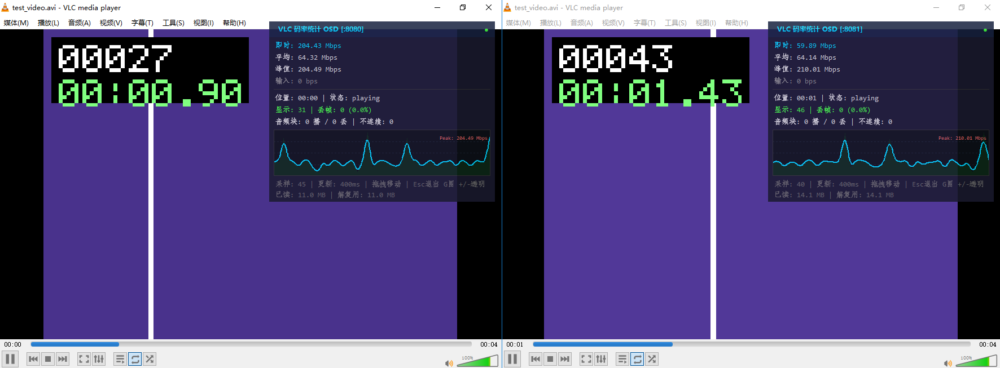

# VLC Bitrate OSD

给 VLC 加上实时码率、丢帧与流漂移监控——直接叠在播放器画面上。

by yhw1993.USTC



VLC 能给你画面，却看不到流的健康状况。这个项目提供两种独立的查看方式：

- **Python OSD 浮窗**——半透明置顶窗口，显示即时 / 平均 / 峰值码率、丢帧、音频缓冲统计和实时码率曲线。通过 VLC 内置的 HTTP 接口取数。
- **VLC Lua 扩展**——用 VLC 自己的 OSD 通道和 marquee 滤镜实现播放器内叠加，不需要额外进程。

另外附带 **`vlc_sync.py`**：双 VLC 时间戳同步工具，典型场景是把设备通过 RTSP 发来的二次编码流与本地原始文件对齐，逐帧比对。

## 为什么需要它

如果你在做编码器调优、追码率控制的 bug，或者验证设备实际发出的码流，你会反复问：

- 码率真的稳在配置值上，还是在剧烈抖动？
- 峰值出现在哪里？
- 有没有丢帧，丢帧率多少？
- 二次编码后的流和源还同步吗？

VLC 是最顺手的播放器，这些数据它内部全都采集了——只是从不显示出来。这个项目把它们露出来。

## 环境要求

- VLC 3.0+
- Python 3.7+，**需带 tkinter**
- **无任何第三方依赖**——只用标准库（`urllib`、`xml.etree`、`tkinter`、`ctypes`）

浮窗的窗口吸附是 Windows 专属（用的是 Win32 `EnumWindows`），其余部分跨平台。

## 快速开始

### 1. 带 HTTP 接口启动 VLC

```
vlc --extraintf http --http-port 8080 --http-password vlc123
```

Windows 上也可以直接运行 `scripts/start_vlc_osd.bat`。与本机相关的路径（Python 解释器、VLC 安装位置）写进 `scripts/local.bat`——该文件已被 git 忽略，不会进仓库。启动脚本会先确认所用的 Python 确实带 tkinter，避免浮窗刚起来就倒在 import 上。

### 2. 启动浮窗

```
python vlc_bitrate_monitor.py --password vlc123
```

在 VLC 里播放视频，浮窗会自动吸附到 VLC 视频窗口右上角并开始刷新。

### 3. 快捷键

| 操作 | 功能 |
|---|---|
| 鼠标拖拽 | 移动窗口 |
| `G` | 显示 / 隐藏码率曲线 |
| `+` / `-` | 调节透明度 |
| `Esc` / `Q` | 退出 |

## 双实例并排对比

用于 A/B 对比——两路编码，或者一路流对一路源：

```
scripts/start_two_vlc.bat
```

脚本会启动两个 VLC（HTTP 端口 8080 / 8081），各自带一个浮窗，通过 `--instance 0` / `--instance 1` 分别吸附到对应的 VLC 窗口。



## 双播放器同步

`vlc_sync.py` 把其中一个播放器当作主时钟（默认是 RTSP 流，因为它不可控），持续把另一个往主时钟上纠。

```
python vlc_sync.py --a 127.0.0.1:8080 --b 127.0.0.1:8081 --password vlc123 --offset 3
```

| 参数 | 含义 | 默认值 |
|---|---|---|
| `--a` / `--b` | VLC A / B 的 `host:port` | `127.0.0.1:8080` / `:8081` |
| `--master` | 谁做主时钟（`a` 或 `b`） | `b` |
| `--offset` | 等主时钟播到第 N 秒再对齐，用于覆盖网络缓冲期 | `3` |
| `--drift` | 允许的漂移阈值（秒） | `0.5` |
| `--interval` | 纠偏轮询间隔（秒） | `0.5` |
| `--once` | 只对齐一次后退出 | 关 |

**同步怎么维持的**

1. 等主时钟过 `--offset` 秒，确保 RTSP 的缓冲期已经过去。
2. 暂停从机，seek 到主机当前位置，再同时恢复播放。
3. 持续轮询：从机落后就 seek 快进；从机超前就暂停它一小段，等主机追上（单次最多停 3 秒）。

## 实现原理

### 码率是用字节差值算的，不是直接用 VLC 的数值

VLC 暴露了 `demuxbitrate` 和 `inputbitrate`，但这两个都是**指数滑动平均**——有滞后，而且暂停后不会归零。本工具改为采样 `demuxreadbytes`，用差值除以时间间隔，得到真实的即时码率。

改这份代码前有两件事需要知道：

- **单位问题。** VLC 内部码率值实际是 MB/s，不是 bit/s。`BitrateTracker.update()` 里对小于 1000 的值乘以 1048576，统一换算成 bytes/s。
- **本地文件的情况。** 本地文件被 VLC 读进缓存后，字节计数器就不再增长，差值归零，但播放仍在继续。此时代码回退到 VLC 内部的平滑值——而这个回退只在 `state == "playing"` 时生效，否则暂停状态下会报出一个陈旧的、非零的码率。

### 窗口吸附

浮窗用 `ctypes` 调 `EnumWindows` 枚举窗口，按面积降序排列，吸附到第 N 个——`--instance` 就是选这个序号。找不到 VLC 窗口时退化为屏幕角落偏移，避免多个浮窗互相叠压。

### 为什么快捷键要全局绑定

窗口用 `overrideredirect(True)` 去掉了标题栏。这类窗口在 Windows 下拿不到键盘焦点，所以绑在 root 上的普通 `bind()` 永远不会触发。代码改用 `bind_all()`，并在退出时 `unbind_all()`，防止快捷键泄漏到其他程序。

### VLC 3.0 的 seek bug

`vlc_sync.py` 只按整秒 seek。VLC 3.0 的 HTTP `seek` 命令处理小数秒有 bug——`seek&val=13.52` 会跳到 52 秒——所以代码统一取整，剩余误差交给纠偏循环吸收。

### 暂停命令

`in_pause` 是暂停，`pl_pause` 是切换。同步脚本优先用 `in_pause`，对未实现该命令的版本回退到 `pl_pause`。

## Lua 扩展（播放器内方案）

`lua/bitrate_osd.lua` 使用 VLC 自带的 OSD 通道加 marquee 滤镜，播放器之外不跑任何进程。

把它复制到 VLC 的扩展目录，重启 VLC：

| 平台 | 路径 |
|---|---|
| Windows | `%APPDATA%\vlc\lua\extensions\` |
| Linux | `~/.local/share/vlc/lua/extensions/` |
| macOS | `~/Library/Application Support/org.videolan.vlc/lua/extensions/` |

然后在菜单里打开 **视图 → 码率统计 OSD**。

| | Lua 扩展 | Python 浮窗 |
|---|---|---|
| 是否在 VLC 内运行 | 是 | 否 |
| 叠加方式 | VLC OSD + marquee | 半透明置顶窗口 |
| 码率曲线 | 文本柱状图 | Canvas 实时曲线 |
| 稳定性 | 依赖 Lua API | 不碰内部 API |
| 多实例 | 每播放器一个 | `--instance` 各自吸附 |
| 适用场景 | 快速查看 | 长时间监控 |

## 命令行参考

### vlc_bitrate_monitor.py

| 参数 | 默认值 | 含义 |
|---|---|---|
| `--host` | `127.0.0.1` | VLC HTTP 地址 |
| `--port` | `8080` | VLC HTTP 端口 |
| `--password` | 空 | VLC HTTP 密码 |
| `--interval` | `500` | 刷新间隔（毫秒） |
| `--no-graph` | 关 | 不显示码率曲线 |
| `--instance` | `0` | 吸附到第几个 VLC 窗口 |

### vlc_sync.py

见上文参数表。

`scripts/make_test_video.py` 可以生成一段烧了帧号和时间码的测试视频——这是验证同步是否真在生效的最实用手段，因为两个窗口上的帧号可以直接读出来对比。

## 已知限制

- **窗口吸附仅支持 Windows。** 用的是 Win32 接口。其他平台浮窗仍能运行，但位置要自己拖。
- **直播流无法 seek。** RTSP 直播流没有可 seek 的时长，只能靠暂停/恢复对齐，精度受 GOP 长度限制。
- **`--drift` 默认 0.5 秒。** 因为 seek 会落到最近的关键帧而不是精确时间点。把它调到小于一个 GOP 的长度会导致持续纠偏。
- **本工具只读统计，不做解码。** 所有数字都来自 VLC 自己的计数器；VLC 不报的字段，这里也拿不到。

## 排查

| 现象 | 原因 / 处理 |
|---|---|
| 浮窗显示"未连接" | VLC 没开 HTTP 接口。用 `--extraintf http` 重启。 |
| 播放中码率显示 0 | 字节计数器没增长（本地文件已全部缓存），且 VLC 也没报内部码率。 |
| 浮窗跑到屏幕角落 | 没匹配到 VLC 窗口——标题必须同时包含 "VLC" 和 "media player"。 |
| 快捷键没反应 | 全局绑定被其他程序抢了。先点一下浮窗再按。 |
| 同步一直在纠偏 | `--drift` 小于一个 GOP 时长，调大。 |
| HTTP 401 | VLC 的 `--http-password` 与工具的 `--password` 不一致。 |
| 启动脚本报"没有带 tkinter 的 Python" | 系统默认的 `python` 不带 tkinter（嵌入式/绿色版包常见）。在 `scripts/local.bat` 里把 `PYTHON` 指向一个带 tkinter 的解释器完整路径。 |

## 许可

MIT，见 [LICENSE](LICENSE)。
